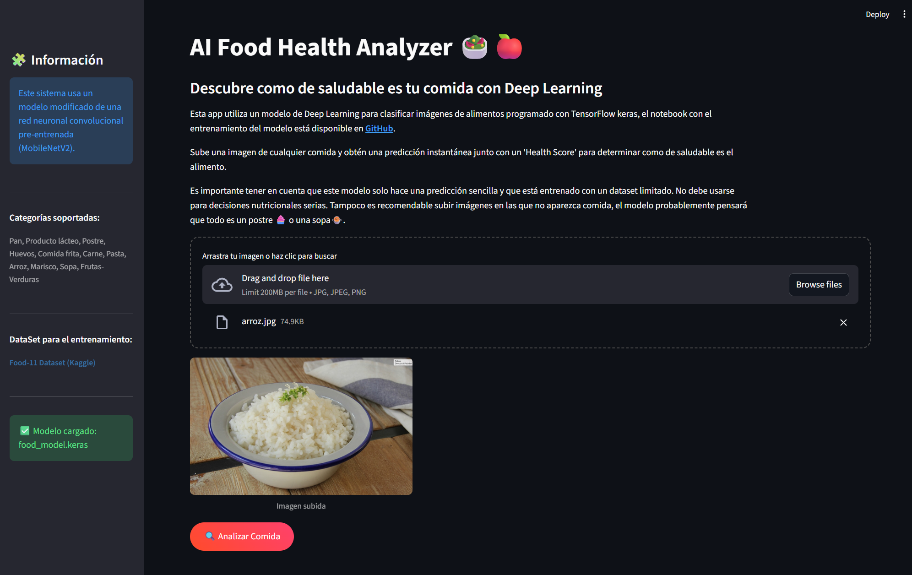
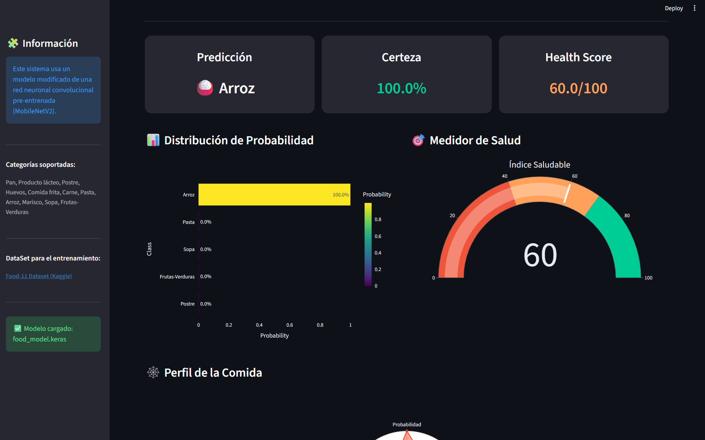

# Clasificador de Alimentos con IA


Este proyecto consiste en el desarrollo y entrenamiento de una red neuronal convolucional que detecta y clasifica imágenes de comidas obtenidas del siguiente dataset de kaggle: [**Food-11 Dataset (Kaggle)**](https://www.kaggle.com/datasets/trolukovich/food11-image-dataset)

El proyecto está dividido en dos partes:

- La parte relacionada con la creación del modelo se detalla en este notebook de Google Colab: [**cnn_food_classifier.ipynb**](https://colab.research.google.com/drive/1uwc5RUmsmYazoQ1JsSvxCn8TxIyvDJu9?usp=sharing)

- En este repositorio de GitHub está el código de la aplicación de Streamlit que implementa el modelo en un ejemplo práctico en el que se puede comprobar como funciona con cualquier imagen que se suba, no solas las del dataset de entrenamiento.

---

## Características

| 🔍 Función | 📌 Descripción |
|-----------|----------------|
| ⚡ Clasificación rápida | Modelo basado en MobileNetV2 |
| 📊 Resultados claros | Probabilidades y visualización |
| 🖼️ Preprocesado automático | Resize + normalización |

---

## Guía de instalación

Para poder usar la aplicación de este repositorio hay que seguir los siguientes pasos:

1. Acceder al colab que se ha mencionado antes ([**cnn_food_classifier.ipynb**](https://colab.research.google.com/drive/1uwc5RUmsmYazoQ1JsSvxCn8TxIyvDJu9?usp=sharing)) y ejecutar todas las celdas, al final se descargará el modelo .keras entrenado, dentro de este notebook está detallada toda la información relacionada.

2. Clonar el repositorio:
```bash
git clone https://github.com/DiegoAladren/cnn-food-classifier.git
cd cnn-food-classifier
```
3. Crear y activar un entorno virtual:
```bash
python -m venv venv
# Windows
venv\Scripts\activate
# Mac/Linux
source venv/bin/activate
```
4. Instalar las dependencias necesarias:
```bash
pip install -r requirements.txt
```
5. Poner el modelo .keras descargado anteriormente en la carpeta models/.

6. Ejecutar la aplicación con streamlit, desde la carpeta del proyecto:
```bash
streamlit run src/app.py
```

Después de seguir estos pasos solo falta esperar a que funcione la aplicación en el navegador, el puerto que usará estará indicado después de ejecutar el comando anterior, las aplicaciones de streamlit pueden tardar unos segundos en cargar la primera vez.

---

## Ejemplo de uso

Una vez este funcionando la aplicación solo hay que seleccionar una imagen desde archivos o arrastrarla al contenedor donde se indica, a continuación se muestra una captura de la interfaz:



Después de darle a analizar imagen el modelo calcula la predicción y la aplicación muestra estadísticas relacionadas al contenido de la imagen:



---

## Roadmap

- [x] Generar modelo de Deep Learning para analizar imágenes de comida.
- [x] Integrar modelo con la aplicación de streamlit.  
- [x] Calcular estadísticas y mostrarlas en la aplicación a partir de las predicciones.

---

## Contacto

Para preguntas o feedback contáctame a: diegoaladren854@gmail.com

LinkedIn: www.linkedin.com/in/diego-aladrén-mateo-7a6034307
